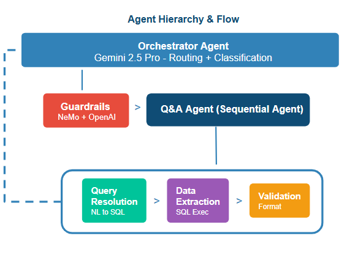

# Retail Insights Agent

A GenAI-powered multi-agent system for retail sales analytics. Built to interpret natural language queries, generate SQL, and deliver business insights from structured sales data.


## Architecture


## Technologies

| Component | Technology | Role |
|-----------|------------|------|
| Agent Framework | Google ADK | Multi-agent orchestration |
| Orchestrator Model | Gemini 2.5 Pro | Root agent - reasoning, routing, synthesis |
| Pipeline Agent Model | Gemini 2.5 Flash | Sub-agents - query, extraction, validation |
| SQL Generation | PandasAI + OpenAI GPT-4o | Natural language to SQL |
| Query Engine | DuckDB | In-memory OLAP analytics |
| Security | NVIDIA NeMo Guardrails | Input validation, off-topic blocking |


## Setup & Execution

### Prerequisites

- Python 3.10+
- Google Cloud account with Vertex AI enabled
- OpenAI API key

### Installation

```bash
# 1. Create virtual environment
python -m venv venv

# 2. Activate
venv\Scripts\activate        # Windows
source venv/bin/activate     # Mac/Linux

# 3. Install dependencies
pip install -r requirements.txt
```

### Configuration

```bash
cp .env.example .env
```

Edit `.env` with:
```
OPENAI_API_KEY=your_openai_key
GOOGLE_SERVICE_ACCOUNT_FILE=service-account.json
GOOGLE_CLOUD_PROJECT=your_project_id
GOOGLE_CLOUD_LOCATION=us-central1
```

Place your GCP service account JSON (`service-account.json`) in this folder.

### Run

```bash
adk web
```

Open http://127.0.0.1:8000 and select `retail_insights_agent` from the dropdown:


## Demo Examples

### Q&A Mode
```
"What are the top 5 selling categories?"
"Show sales by state"
"What is the cancellation rate?"
"Total revenue for shipped orders"
"Which city has the most orders?"
```

### Summarization Mode
```
"Give me a business summary"
"Summarize the sales performance"
```

### Guardrails (Blocked Queries)
```
"Write me an email"
"DROP TABLE orders"
"Tell me a joke"
"What's the weather today?"
```


## Multi-Agent Design



| Agent | Responsibility |
|-------|----------------|
| **Orchestrator** | Classifies input (greeting vs data query), enforces guardrails, routes to pipeline |
| **Query Resolution** | Converts natural language to SQL using PandasAI |
| **Data Extraction** | Executes SQL against DuckDB, returns results |
| **Response Validation** | Formats output, adds business insights |


## Data Engineering Notes

We analyzed 7 CSV files from the provided dataset:

| File | Rows | Decision | Reason |
|------|------|----------|--------|
| Amazon Sale Report.csv | 128K | Selected | Clean schema, complete transactions |
| International sale Report.csv | 37K | Skipped | Mixed schemas, embedded tables, date range mismatch |
| Sale Report.csv (Inventory) | 9K | Skipped | No date column, different SKU format |
| May-2022.csv (Pricing) | 1.3K | Skipped | Zero SKU overlap with sales data |
| P L March 2021.csv | 1.3K | Skipped | Duplicate pricing data |
| Cloud Warehouse Compersion Chart.csv | 51 | Skipped | Not tabular - process document |
| Expense IIGF.csv | 18 | Skipped | Not tabular - expense sheet |

**Selected**: Amazon Sale Report (128K orders, Apr-Jun 2022) provides clean, consistent data with all key dimensions for retail analytics.


## Assumptions

1. **Data**: Raw CSV is clean enough for direct loading - no ETL pipeline needed for demo
2. **Data**: Null values in Amount column are valid (cancelled/pending orders, not errors)
3. **Users**: Single user, synchronous requests - no concurrent access handling
4. **Cost**: Demo-level usage - token costs not optimized for production
5. **Infra**: Local single-machine deployment - no distributed infrastructure


## Limitations

1. **Data**: Only 3 months of data (Apr-Jun 2022) - cannot perform YoY or long-term trend analysis
2. **Data**: Single source (Amazon India) - no cross-channel or multi-marketplace insights
3. **Schema**: Table schema hardcoded in agent prompts - won't adapt to schema changes
4. **Context**: Session-based memory only - no conversation history across sessions
5. **Scale**: In-memory DuckDB - fast (<100ms queries) but limited by available RAM
6. **Cache**: No query result caching - repeated questions hit LLM each time
7. **Observability**: Basic logging only - no metrics, latency tracking, or cost monitoring


## Possible Improvements

- **Retry Logic**: Add exponential backoff for LLM API calls to handle transient failures
- **Query Caching**: Cache SQL results for repeated questions (Redis) to reduce latency and cost
- **BigQuery Migration**: Replace DuckDB with BigQuery to handle 100GB+ datasets
- **ETL Pipeline**: Add PySpark or Dataflow for data preprocessing at scale
- **Dynamic Schema**: Use RAG to retrieve table schemas instead of hardcoding in prompts
- **Conversation Memory**: Persist chat history in Redis for multi-session context
- **Observability**: Add Prometheus metrics and OpenTelemetry tracing for production monitoring


## Project Structure

```
retail_insights_repo/
|-- .env.example           # Environment template
|-- requirements.txt       # Dependencies
|-- service-account.json   # GCP credentials (you provide)
|-- README.md              # This file
|-- reference_img.png      # ADK UI screenshot
|
|-- retail_insights_agent/ # ADK Multi-Agent System
|   |-- config.py          # Configuration and table schema
|   |-- agent.py           # ADK entry point
|   |-- __init__.py        # Package init, loads DuckDB on startup
|   |
|   |-- agents/
|   |   |-- orchestrator.py       # Root agent with guardrails
|   |   |-- pipeline.py           # SequentialAgent (analytics_agent)
|   |   |-- query_resolution.py
|   |   |-- data_extraction.py
|   |   +-- response_validation.py
|   |
|   |-- tools/
|   |   |-- guardrail.py       # input_guardrail()
|   |   |-- sql_generator.py   # generate_sql()
|   |   +-- sql_executor.py    # execute_sql()
|   |
|   |-- database/
|   |   |-- duckdb/            # Connection, query execution
|   |   +-- pandasai/          # NL-to-SQL generation
|   |
|   |-- guardrails/
|   |   +-- nemo/              # NeMo config and validator
|   |
|   +-- data/
|       +-- Amazon Sale Report.csv
|
|-- presentation/          # Architecture slides and images
+-- screenshots/           # Demo evidence
```

---

